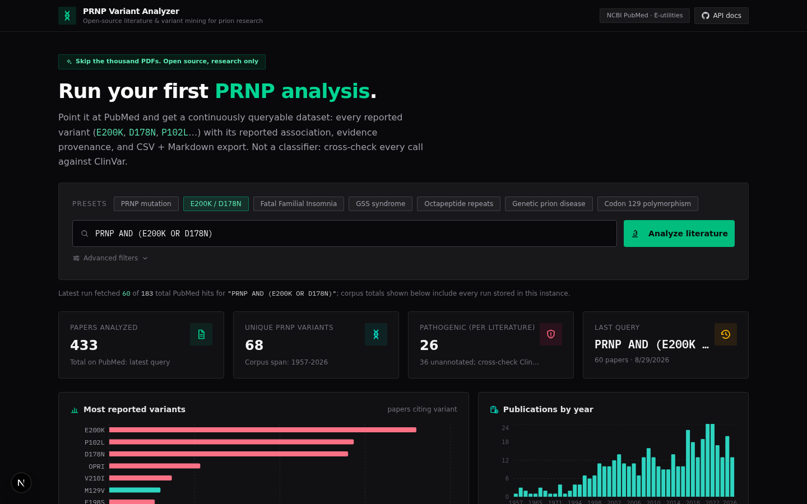

# PRNP Variant Analyzer

*Turn PRNP literature into a structured variant/evidence dataset.*

**Live Demo → [https://prnp-variant-analyzer.space-z.ai/](https://prnp-variant-analyzer.space-z.ai/)**

[](https://github.com/trinik15/prnp-variant-analyzer/actions/workflows/ci.yml)



The PRNP literature is scattered across thousands of papers, and the variants
are locked inside prose. This tool queries PubMed through the public NCBI
E-utilities, scans every fetched abstract for amino-acid variant mentions,
normalizes them (one-letter, three-letter, and codon-129 shorthand notations),
and pairs each call with a curated knowledge base entry, an evidence tier, and
full provenance. Everything lands in a queryable dataset you can explore in the
browser and export as CSV or Markdown.

**Research use only.** This is not a classifier or a clinical tool. Evidence
tiers describe what the literature reports about a variant; every call should
be cross-checked against [ClinVar](https://www.ncbi.nlm.nih.gov/clinvar/).

## What you get

- **One-click corpus runs** against PubMed with presets (`E200K / D178N`,
  `Fatal Familial Insomnia`, `Octapeptide repeats`, ...) or any free query.
  Every run becomes a shareable URL.
- **Structured variant table** with codon, domain, mutation type, reported
  association, and per-variant dossier: position on the 253-aa PRNP protein,
  evidence tier, provenance (paper PMIDs, curated sources), and the papers in
  your corpus that cite it.
- **Frequency report** recomputed from stored abstracts, exportable as
  Markdown (`/api/report?format=md`).
- **CSV exports** for variants and papers, generated live from the database.
- **Text extraction playground**: paste any abstract or paragraph, get
  structured variants back, plus a one-click adversarial stress test
  (synonyms, `129M`/`Val129` shorthand, multi-variant paragraphs, cross-gene
  lookalikes, contradictory evidence).
- **Cross-field context**: live PubMed corpus sizes for the connected fields
  (scrapie, kuru, BSE, alpha-synuclein seeding, RT-QuIC), each launchable as
  its own analysis.
- **Machine-readable surface** for AI agents: `/llms.txt` plus real PNG
  renders of the UI under `/screenshots/`.

## The pipeline

```
PubMed query (E-utilities, no API key)
  → fetch abstracts + metadata (3 req/s, rate-limited)
  → regex variant detection (1-letter and 3-letter codes)
  → normalize (synonyms merged, codon-129 shorthand folded into M129V)
  → filter (codon window 40-243, non-PRNP lookalike blacklist: SNCA A53T,
    HFE H63D, SARS-CoV-2 D614G, ...)
  → match curated knowledge base → evidence tier + provenance
  → store (SQLite via Prisma) → explore, chart, export (CSV / Markdown)
```

## Machine-readable API

| Endpoint | Description |
|---|---|
| `GET /api/stats` | corpus totals |
| `GET /api/variants` | all variants with annotations |
| `GET /api/papers` | all papers with detected variants |
| `GET /api/report` · `?format=md` | variant frequency report (JSON / Markdown) |
| `GET /api/export?type=variants\|papers` | CSV download |
| `POST /api/extract` | `{"text": "..."}` → structured variants + guard breakdown |
| `GET /api/showcase` | pre-computed example run |
| `GET /llms.txt` | index of the above, for AI agents |

## Run it yourself

```bash
# web app
bun install            # or npm install
bun run db:push        # create the SQLite database (Prisma)
bun run dev            # http://localhost:3000
```

Standalone Python pipeline (no web app needed):

```bash
pip install biopython
python public/scripts/prnp_pubmed_variants.py                      # last 100 papers, Markdown to stdout
python public/scripts/prnp_pubmed_variants.py "PRNP AND E200K" 300 # custom query + retmax
```

The Python script mirrors the TypeScript engine: same variant regexes, same
codon-129 shorthand handling, same non-PRNP lookalike blacklist. Both engines
produce identical output on the adversarial test suite.

## Tech stack

Next.js (App Router) · TypeScript · Prisma + SQLite · Tailwind CSS · Recharts · Biopython (standalone pipeline)

## Questions & suggestions

For usage questions and feature ideas, prefer a
[Discussion](https://github.com/trinik15/prnp-variant-analyzer/discussions)
over an issue.

## License

MIT. Data comes from NCBI PubMed via the public E-utilities API. Please respect
the [NCBI usage policies](https://www.ncbi.nlm.nih.gov/books/NBK25499/) when
self-hosting.
